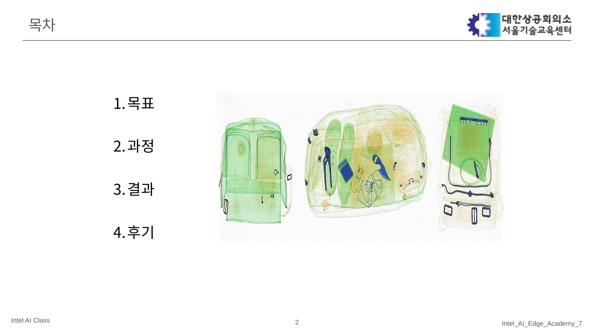
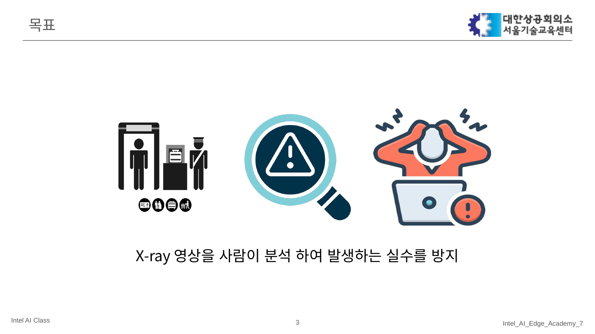
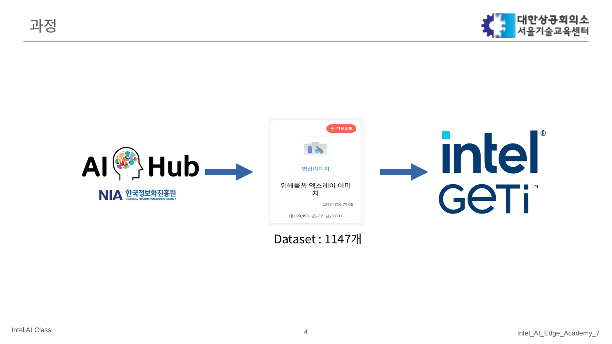
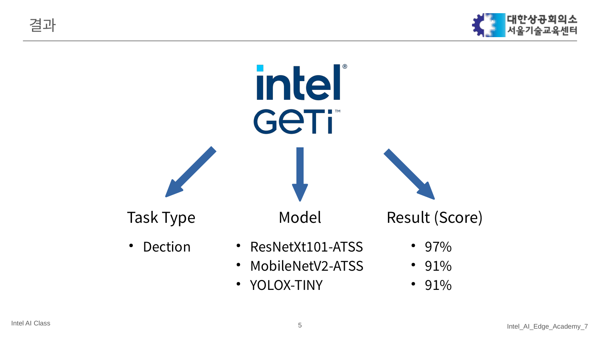
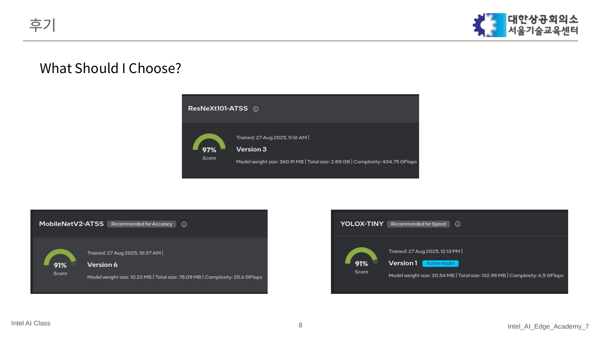

# Intel7_AI_Project_Danger_Xray

## 프로젝트 소개
- X-ray 영상에서 위험물을 자동으로 검출하여 사람이 수동으로 판독할 때 발생할 수 있는 실수를 줄이는 것을 목표로 한 프로젝트입니다.

## 목표
- Intel GETi (MLOPs) 활용
- 데이터 어노테이션 > GETi 제공 모델 활용 및 파라메터 수정
- X-ray 영상을 사람이 분석하여 발생하는 실수를 방지하고, 보다 신뢰할 수 있는 검출 결과를 제공하는 시스템 구축

## 데이터셋
- AI Hub 데이터를 활용
- 총 1,147장의 X-ray 이미지 사용

## 모델 및 접근 방식
- Task: 객체 검출(Object Detection)
- 실험한 모델
  - ResNeXt101-ATSS
  - MobileNetV2-ATSS
  - YOLOX-TINY

## 결과 (발표자료 기준)
- ResNeXt101-ATSS: 97% (Score)
- MobileNetV2-ATSS: 91% (Score)
- YOLOX-TINY: 91% (Score)
- Score 정의: Intel GETi로 어노테이션을 진행하고 각 모델을 학습·평가한 뒤, GETi 대시보드에서 확인한 성능 Score입니다. 프로젝트 설정에 따라 구성 지표(mAP/F1 등)가 달라질 수 있습니다.

## 후기/교훈 (내가 배운 것)
### Dataset Important? — 데이터셋의 중요성

  - 데이터셋 품질과 라벨 일관성이 성능을 좌우한다는 점을 체감했다.
  - 모델을 바꾸는 것보다 라벨 정제·증강이 더 큰 개선을 주는 경우가 있었습니다.

### What Should I Choose? — 모델 선택에 대해 배운 점

  | 모델 | 연산량 (GFLOPs) | 모델 크기 | Score | 권장 시나리오 |
  |---|---:|---:|---:|---|
  | ResNeXt101-ATSS | 434.75 | 2.88 GB | 97% | 서버/GPU, 최고 정확도 |
  | MobileNetV2-ATSS | 20.6 | 78.09 MB | 91% | 메모리 제한/임베디드 |
  | YOLOX-TINY | 6.5 | 163 MB | 91% | 지연시간 민감/실시간 |

  - 정확도 vs 리소스: 
    - 정확도 : ResNeXt101-ATSS=서버/GPU 적합
    - 리소스 : MobileNetV2·YOLOX-TINY=엣지/실시간 적합
  - 제약 먼저: 지연(ms)·메모리(MB)·배포(서버/엣지)
  
  위 결과를 통해 모델에 따른 고려 사항들을 배울 수 있었음.

## 발표자료
- 발표 PDF: `발표자료/X-Ray_detect.pdf`
- 슬라이드 이미지: `docs/images/presentation/slide-*.png`
- 작성: 윤치영

> 사용법(환경 설정, 학습/추론 스크립트 등)은 프로젝트 코드 정리 후 추가 예정입니다.
